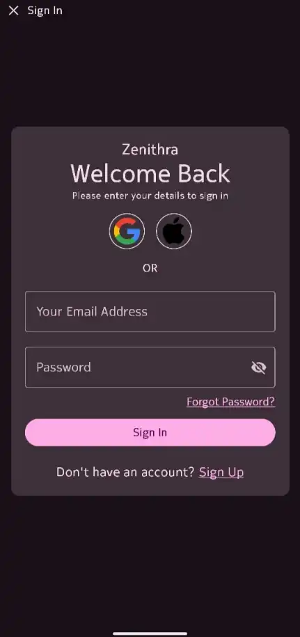
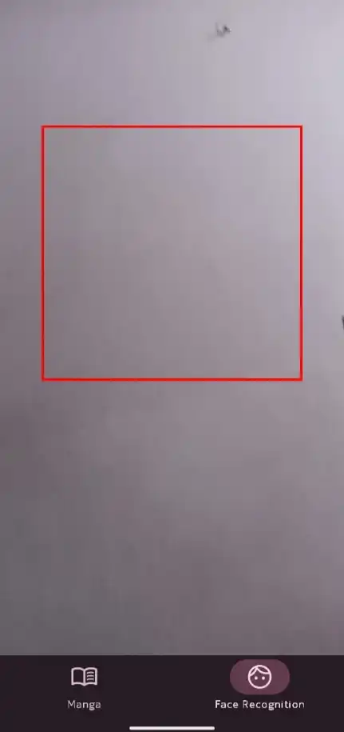

# PupilMesh Assignment


---

## ✨ Task Overview

This project was developed as part of an Android Development task. The requirements included:

- Sign In screen using Room DB to store user credentials.
- Bottom Navigation with two items: Manga screen and Face Recognition screen.
- Manga screen that fetches manga data using the MangaVerse API from RapidAPI.
- Manga detail screen showing selected manga information.
- Face detection using MediaPipe Face Detection with real-time camera feed.
- Clean Architecture with MVVM pattern and Single Activity navigation using Navigation Component.

---

## 📸 Screenshots


  <table align = "center">
    <tr>
      <td align="center"></td>
      <td align="center"></td>
    </tr>
    <tr>
      <td align="center"></td>
      <td align="center"></td>
    </tr>
  </table>


---


## 🎬 Demo

<div align="center">
  <video src="https://github.com/user-attachments/assets/2e85757a-4d72-4209-ba21-d727f668ea31" ></video>
</div>


---

## 🛠️ Tech Stack

- **Language**: Kotlin
- **UI**: Jetpack Compose
- **Architecture**: MVVM + Clean Architecture
- **Navigation**: Jetpack Navigation Component (Single Activity)
- **Local Storage**: Room DB
- **Dependency Injection**: Koin
- **Manga API**: [MangaVerse API](https://rapidapi.com/sagararofie/api/mangaverse-api)
- **Face Detection**: [MediaPipe Face Detection](https://ai.google.dev/edge/mediapipe/solutions/vision/face_detector/android)

---

🚀 Getting Started
------------------

### Prerequisites

-   Android Studio Hedgehog or later
-   Minimum SDK: 26
-   RapidAPI subscription for MangaVerse

### Setup

1.  **Clone the repository**

```
git clone https://github.com/your-username/PupilMeshAssignment.git
cd PupilMeshAssignment
```

2.  **Configure API Key**

Open local.properties and add:

```
MANGAVERSE_API_KEY=your_rapidapi_key_here
```

3.  **Build the app**


```
./gradlew assembleDebug
```

4.  **Run the app** on an emulator or physical device

📂 Important Info
-----------------

-   Screenshots and demo video are located in the `submission/` directory.
-   Built APK is available in the `releases/` folder.
-   API keys are managed securely using local.properties and are not committed to version control.
